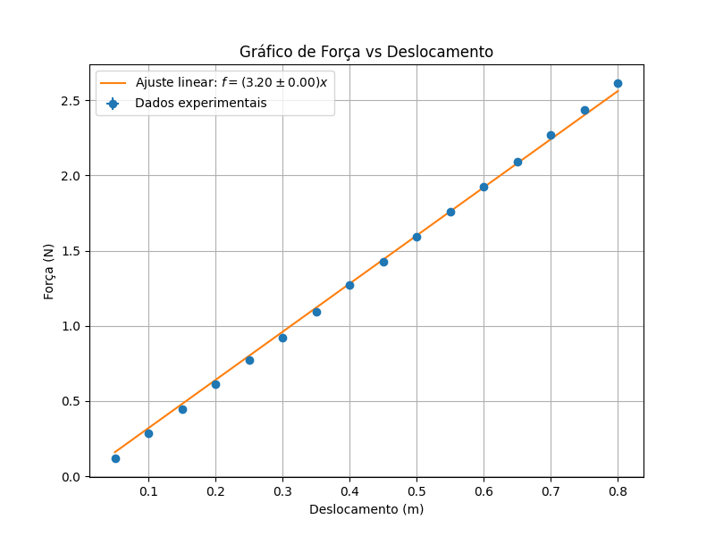
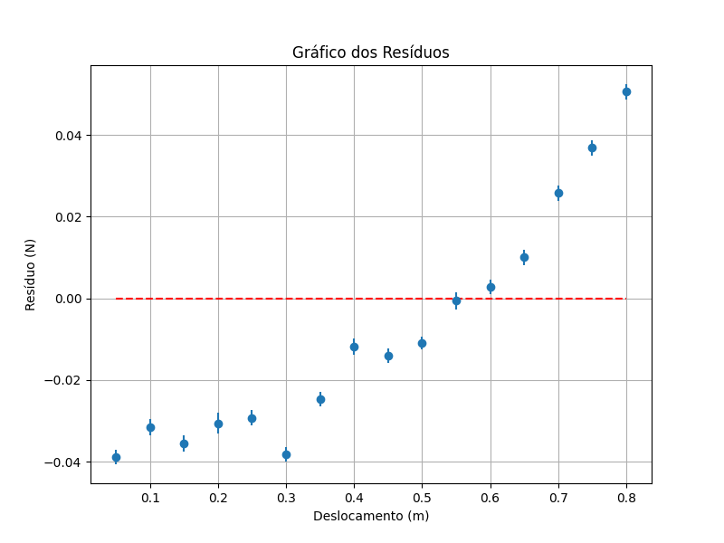

# Análise da Constante de Mola a partir de Dados Experimentais

Este projeto tem como objetivo determinar a constante elástica \( k \) de uma mola a partir de medições experimentais de força e deslocamento. O script em Python realiza uma análise estatística dos dados fornecidos, ajusta um modelo linear e gera gráficos e tabelas para apresentar os resultados.

## Sumário

-   [Requisitos](#requisitos)
-   [Estrutura dos Arquivos](#estrutura-dos-arquivos)
-   [Instruções de Uso](#instruções-de-uso)
-   [Descrição do Código](#descrição-do-código)
-   [Resultados](#resultados)
-   [Referências](#referências)

## Requisitos

-   Python 3.x
-   Bibliotecas Python:
    -   NumPy
    -   Matplotlib
    -   SciPy

Você pode instalar as bibliotecas necessárias usando:

```bash
pip install numpy matplotlib scipy
```

## Estrutura dos Arquivos

-   `script.py`: Código principal em Python que executa a análise.
-   `dados.txt`: Arquivo de dados contendo as medições de força.
-   `tabela.tex`: Código LaTeX gerado para a tabela de dados.
-   `grafico.png`: Gráfico de Força vs. Deslocamento.
-   `residuos.png`: Gráfico dos resíduos do ajuste linear.

## Instruções de Uso

1. **Preparação dos Dados**: Certifique-se de que o arquivo `dados.txt` está no mesmo diretório do script Python. O arquivo deve conter as medições de força, organizadas em colunas separadas por tabulações.

2. **Execução do Script**:

    Execute o script Python:

    ```bash
    python script.py
    ```

    Durante a execução, o programa solicitará:

    - **Deslocamento inicial (em cm)**: Valor inicial do deslocamento da mola.
    - **Incremento de deslocamento (em cm)**: Intervalo de aumento do deslocamento entre as medições.

3. **Saída**:

    - **Constante de mola \( k \)**: O valor calculado da constante elástica será exibido no terminal com sua incerteza.
    - **Arquivos Gerados**:
        - `tabela.tex`: Código LaTeX para a tabela de medições.
        - `grafico.png`: Gráfico plotado de Força vs. Deslocamento com o ajuste linear.
        - `residuos.png`: Gráfico dos resíduos do ajuste.

## Descrição do Código

O script executa as seguintes etapas:

1. **Leitura e Processamento dos Dados**:

    - Lê o arquivo `dados.txt` e processa as medições de força.
    - Calcula a média e a incerteza das forças para cada deslocamento.

2. **Ajuste Linear**:

    - Converte os deslocamentos de centímetros para metros.
    - Realiza um ajuste linear \( f = kx \) usando o método dos mínimos quadrados ponderados.
    - Calcula a constante elástica \( k \) e sua incerteza \( \delta k \).

3. **Propagação de Incertezas**:

    - Propaga as incertezas instrumentais e estatísticas das medições.
    - Combina as incertezas das forças e dos deslocamentos.

4. **Geração da Tabela LaTeX**:

    - Cria o código LaTeX para uma tabela que apresenta os valores de deslocamento e força com suas respectivas incertezas.

5. **Plotagem dos Gráficos**:
    - **Gráfico de Força vs. Deslocamento**: Inclui barras de erro e a reta do ajuste linear.
    - **Gráfico dos Resíduos**: Mostra a diferença entre os valores medidos e os valores previstos pelo modelo.

## Resultados

-   **Constante de mola**:

    ```
    Constante de mola k = [valor] N/m ± [incerteza] N/m
    ```

    _(O valor e a incerteza serão exibidos após a execução do script.)_

-   **Gráficos**:

    

    _Gráfico mostrando a relação linear entre força e deslocamento._

    

    _Gráfico dos resíduos do ajuste linear, indicando a qualidade do ajuste._

-   **Tabela de Dados**:

    O arquivo `tabela.tex` contém o código para gerar uma tabela em LaTeX com os dados processados.

## Referências

-   **Lei de Hooke**: A relação linear entre a força aplicada a uma mola e o deslocamento produzido é dada por \( f = kx \), onde \( k \) é a constante elástica da mola.
-   **Análise Estatística**: Utiliza média, desvio padrão e propagação de incertezas para uma análise robusta dos dados experimentais.
-   **Ajuste Linear**: O método dos mínimos quadrados ponderados é usado para considerar as incertezas nas medições durante o ajuste.
